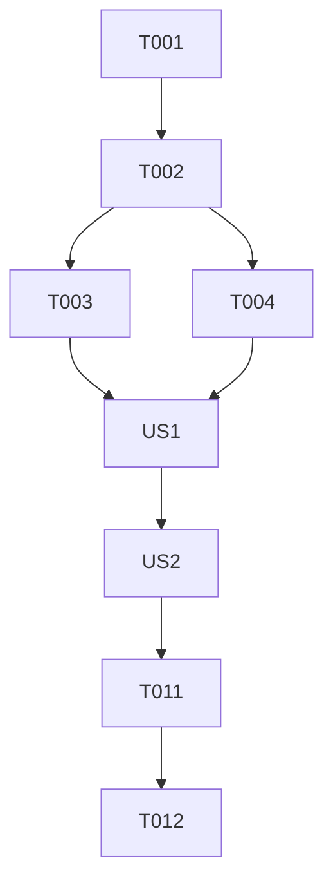

# Tasks: Teams File Upload

**Input**: Design documents from `specs/001-teams-file-upload/`
**Prerequisites**: plan.md (required), spec.md (required for user stories), research.md, data-model.md, contracts/

## Format: `[ID] [P?] [Story] Description`

- **[P]**: Can run in parallel (different files, no dependencies)
- **[Story]**: Which user story this task belongs to (e.g., US1, US2)
- Include exact file paths in descriptions

## Phase 1: Setup

**Purpose**: Project initialization and basic structure

- [ ] T001 Create project structure and verify shared module availability in `src/utils/`
- [ ] T002 Update `src/core/settings.py` to include Graph API settings (Client ID, Secret, Tenant ID)

---

## Phase 2: Foundational (Blocking Prerequisites)

**Purpose**: Core infrastructure that MUST be complete before ANY user story can be implemented

- [ ] T003 [P] Implement Graph API authentication and token caching in `src/utils/file_handler.py`
- [ ] T004 [P] Implement base `download_file` function in `src/utils/file_handler.py` using `requests` or Graph SDK

**Checkpoint**: Foundation ready - user story implementation can now begin

---

## Phase 3: User Story 1 - Secure Multiple File Upload and Access (Priority: P1) 🎯 MVP

**Goal**: Users can upload multiple files via Teams and the bot can access them using a Service Principal.

**Independent Test**: Manually trigger file upload prompt in Teams, upload multiple files, and verify bot logs show successful content retrieval.

### Implementation for User Story 1

- [ ] T005 [US1] Extend `src/bot/base_bot.py` to handle `on_teams_file_consent_accept` and `on_teams_file_consent_decline` activities
- [ ] T006 [US1] Implement `handle_file_consent_accept` logic in `src/utils/file_handler.py` according to `contracts/file_handler_interface.md`
- [ ] T007 [US1] Implement file upload prompt logic using `send_file_consent_card` in `src/bot/foundry_bot.py`
- [ ] T008 [US1] Update `src/utils/file_handler.py` to support `UploadedFile` and `FileUploadState` defined in `data-model.md`

**Checkpoint**: At this point, User Story 1 should be fully functional and testable independently.

---

## Phase 4: User Story 2 - Multiple Upload Confirmation Feedback (Priority: P2)

**Goal**: Provide clear Adaptive Card feedback listing all uploaded files.

**Independent Test**: Observe the Adaptive Card response in Teams after a successful multi-file upload.

### Implementation for User Story 2

- [ ] T009 [P] [US2] Extend `src/utils/card_builder.py` to include a template for file upload confirmation feedback
- [ ] T010 [US2] Integrate feedback card delivery in `src/bot/foundry_bot.py` after processing `FileUploadState`

**Checkpoint**: User Story 2 is complete, providing a polished user experience.

---

## Final Phase: Polish & Cross-cutting Concerns

- [ ] T011 [P] Implement comprehensive error handling and logging for file operations in `src/utils/file_handler.py`
- [ ] T012 Update `specs/001-teams-file-upload/quickstart.md` with final deployment and verification steps

## Dependency Graph

## Parallel Execution Examples

- **Foundational**: T003 and T004 can be implemented simultaneously.
- **US2**: T009 can be started as soon as T001 is done, even before US1 is finished.

## Implementation Strategy

- **MVP**: Focus on completing US1 (Phase 1-3) to achieve basic upload and read capability.
- **Incremental**: Add UI feedback (US2) and polish in subsequent steps.
